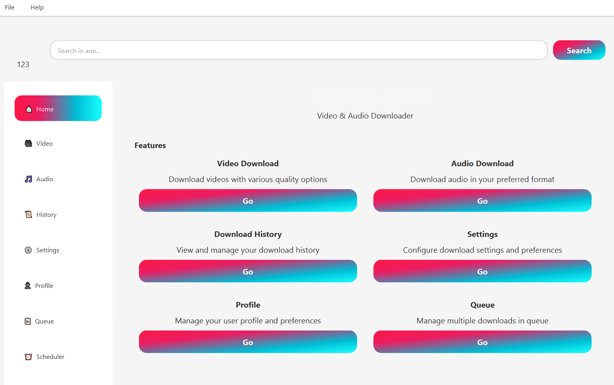
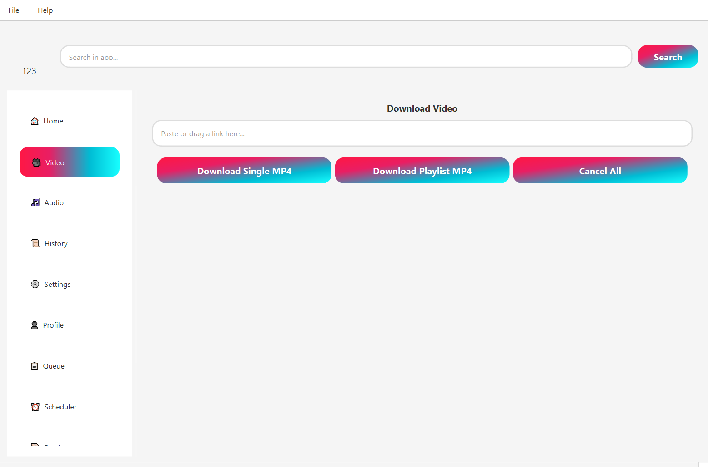
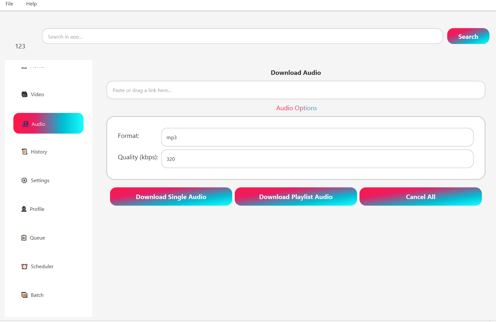
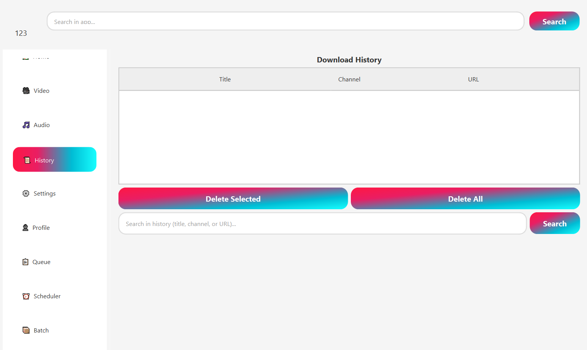

# 💚 Mass TikTok video Downloader 5.0 🎥
Mass TikTok video downloader, Twitter Video Downloader (HD), tiktok video downloader, tiktok video downloader without watermark, tiktok video downloader no watermark, tiktok video downloader 4k.

<div align="center">
  <a href="../../releases/latest">
    
  </a>
</div>

  ### Modern Downloader with Advanced Features
  
  [](https://www.python.org/)
  [](https://pypi.org/project/PySide6/)
  [](https://pypi.org/project/requests/)
  [](https://ffmpeg.org/)
</div>

## 📋 Table of Contents
- [Features](#-key-features)
- [Installation](../../releases)
- [Usage](#-usage)
- [Screenshots](showcase/showcase.md)
- [Contributing](CONTRIBUTING.md)
- [License](LICENSE)

### 📜 Legal 
[](LICENSE)

## 🌟 Key Features

### 🛠️ Core Features
- **Download Support**  
  Download videos and audio from platforms supporting HTTP streams, including YouTube, Vimeo, and more.

- **Smart Playlist Organization**  
  Automatically organizes playlist downloads into dedicated folders named after the playlist.

- **Playlist Downloads**  
  Save entire playlists with sequential processing in just a few clicks.

- **Multiple Formats**  
  Download in **MP4** (video) and multiple audio formats (**MP3**, **M4A**, **WAV**, **AAC**, **FLAC**, **OPUS**, **VORBIS**) with **advanced quality control**.

- **Advanced Audio Quality Control** 🎵  
  Revolutionary audio processing system with **lossless extraction** capabilities:
  - **Smart Copy Mode**: Zero quality loss for M4A/AAC/OPUS formats
  - **User-Controlled Bitrates**: 128k, 192k, 256k, 320k, or "best" quality
  - **Preserve Original Quality**: Avoids unnecessary re-encoding
  - **High-Fidelity Fallback**: 320k bitrate + 48kHz sampling (vs old 192k + 44.1kHz)
  - **Format-Specific Optimization**: Automatic best quality selection per format

- **High-Resolution Support**  
  Supports downloads up to **8K, 4K, 2K, 1080p, 720p, 360p**. Select your preferred resolution in Settings.

- **Modular Codebase**  
  Code has been fully refactored into `core/`, `ui/`, and `tests/` directories for easier maintenance and contribution.

### 🛠️ Advanced Features
- **Batch Processing**  
  Queue multiple downloads and manage them simultaneously. Pause, resume, or cancel downloads easily.

- **Audio Quality Revolution** 🎵  
  Breakthrough audio processing with **67% bitrate improvement** and **zero-loss extraction**:
  - Configure audio bitrate (128k to 320k) and quality preservation
  - Smart copy mode prevents re-encoding when possible
  - Fixes spectogram frequency loss reported in earlier versions
  - Comprehensive settings with helpful tooltips for all audio options

- **Profile Management**  
  Save your preferred settings including username, profile picture, download paths, video resolutions and audio formats.

- **Profile Import/Export**  
  Easily export your profile, settings, history, and profile picture as a single ZIP file, and import them back into the app on any device. Great for backup, migration, or restoring your preferences.

- **Drag & Drop Interface**  
  Add download URLs by dragging them into the app.

- **System Tray Integration**  
  Application runs in the system tray when minimized with quick access menu to restore or quit the app.

- **Enhanced Download System**  
  Improved stability and efficiency with better support for large file downloads and multiple simultaneous downloads.

- **Queue System Optimization**  
  Concurrency management with pause & resume all functionality and bandwidth limiting support via proxy settings.

- **Auto-Updater**  
  Automatically checks for updates and installs them.

### 🎨 User Experience
- **Dark & Light Mode**  
  Switch between Dark and Light themes for better usability.

- **Error Handling**  
  Displays detailed error logs to debug issues.

- **Scheduler**  
  Schedule downloads to start at a specific date and time.

- **Download History**  
  View, search, and manage previous downloads directly in the app.

- **Improved Notification System**  
  Download Complete notifications, Download Failed alerts, and Download Canceled warnings.

- **Enhanced UI**  
  Better UI animations and responsiveness with color-coded log messages and search & filter options in history and queue.

### 🔧 Technical Features
- **FFmpeg Detection**  
  Automatically detects FFmpeg installation and prompts for setup if missing.
  
## Screenshots

### Homepage


### Videopage


### Audiopage


### History


## ⚙️ Installation

### Windows
- Download the latest `.exe` installer or `.zip` archive from [Releases](../../releases)
- Both packages include all dependencies including FFmpeg
- Run the installer or extract the `.zip` and run `Tok Downloader.exe`

## 🔧 Usage

### Basic Usage
```bash
# Launch the app
python main.py
```

### Key Features Usage
- Configure your profile in the **Settings** or **Profile** page
- Use the MP4 or MP3 pages to download videos or extract audio
- Add multiple downloads to the queue and manage them from the Queue page
- Schedule downloads in advance using the Scheduler

### Tips & Tricks
- Use drag & drop for quick URL addition
- Enable system tray for background operation
- Use the scheduler for off-peak downloads
- **Audio Quality**: Set "Preserve Original: Yes" and 320k bitrate for best quality
- **Lossless Audio**: Use M4A/FLAC formats with copy mode for zero quality loss
- Export your profile for easy migration

## ⚠️ Notes

### Requirements
```bash
# FFmpeg Required
# Some features, like audio extraction and video merging, depend on FFmpeg.
# Ensure it's installed and available in your system PATH.

# Third-Party Libraries
# The app uses yt_dlp for downloading and metadata extraction.
# Refer to their GitHub page for details.
```

## 🙏 Contributions

### How to Contribute
```bash
# We welcome contributions to improve Tok Downloader 5.0.
# Please submit issues or pull requests via GitHub.

# Enjoy using Tok Downloader 5.0!
🚀
```

### Development Setup
1. Fork the repository
2. Create a feature branch
3. Make your changes
4. Submit a pull request

## ⚠️ Legal Notice

Downloader is an independent open-source project. It operates independently from YouTube and Google, performing downloads and other operations without using their APIs. This project is not bound by YouTube's terms of service or rules.

---
